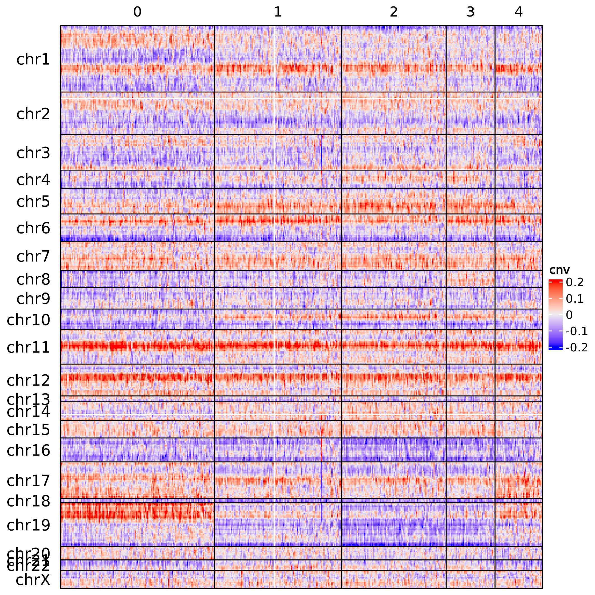
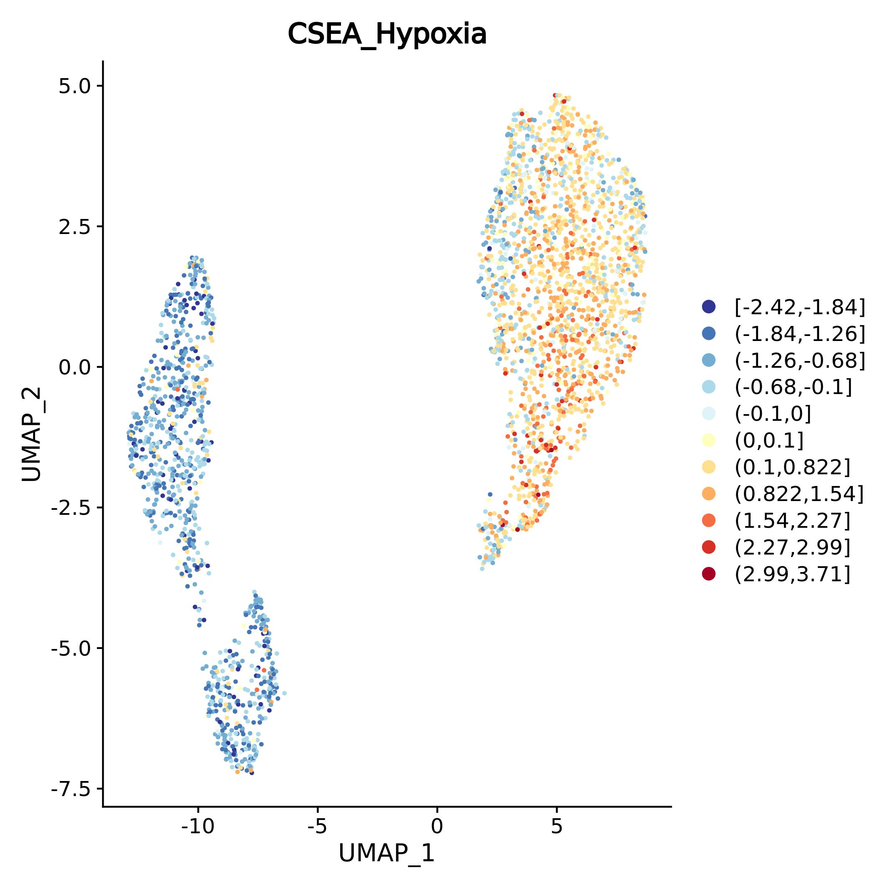
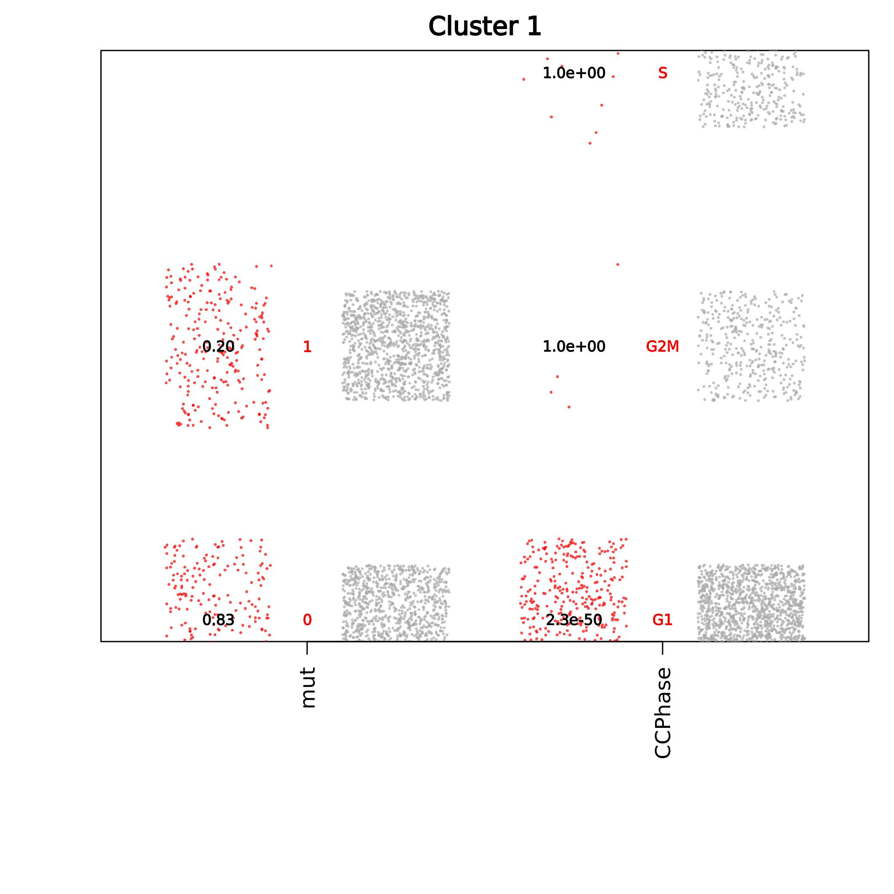
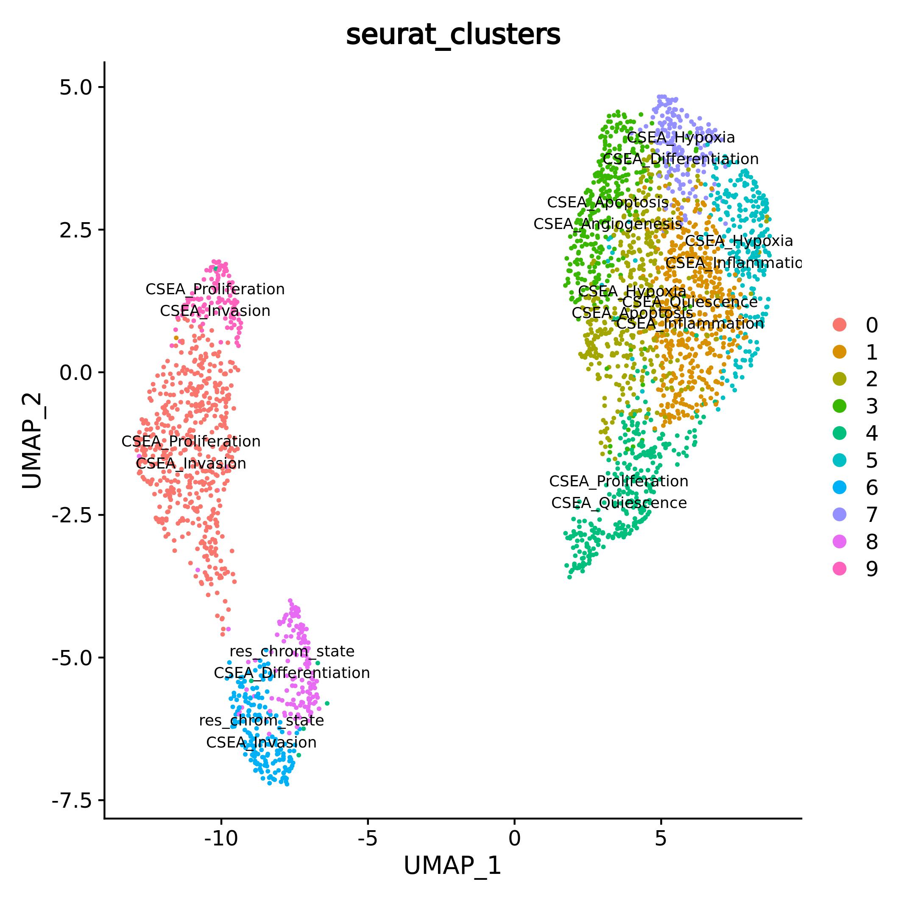
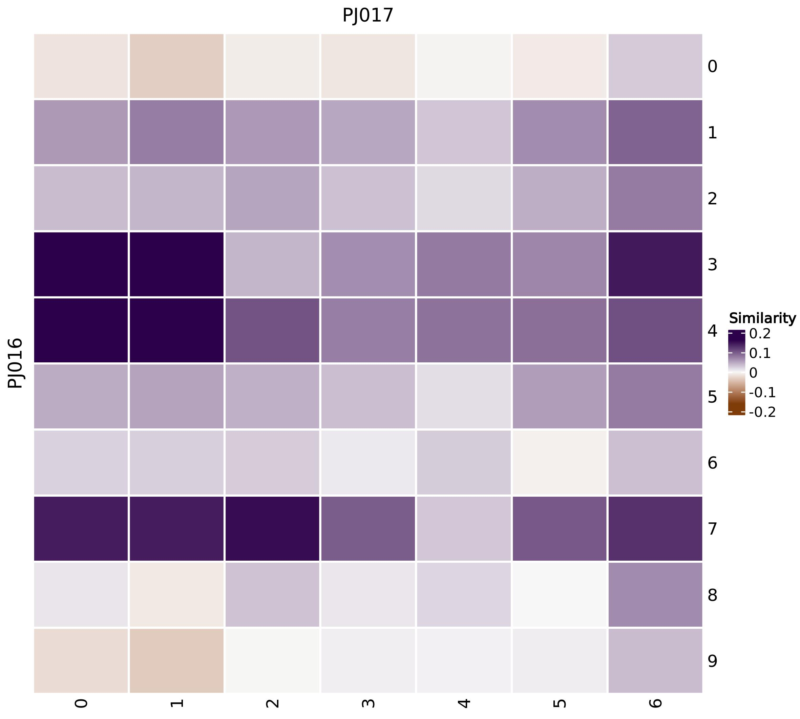

# Getting started

```{r, include=TRUE, echo=FALSE, out.width="60%", fig.align = "center", fig.cap="scMuffing logo"}
knitr::include_graphics("images/scMuffin_logo_pontillism.jpg")
```

```{r, include=TRUE, eval=FALSE}
library(devtools)
install_github("emosca-cnr/scMuffin", build_vignettes = TRUE)
library(scMuffin)
```

```{r, include=F, message=FALSE, warning=FALSE, eval=F}
devtools::load_all()
```


#  Cell-level quantities 

## Gene set scoring

scMuffin provides functions to set up one or more collections of gene sets and perform cell-level estimation of gene set expression in relation to an empirical null model. This can be applied to any gene set, and can therefore be used to estimate various cell’s phenotypes, like pathway activities or marker set expression. The function prepare_gsls retrieves gene sets from CellMarker [Zhang2019], PanglaoDB [@Franzen2019], CancerSEA [@Yuan2019] and MSigDB [@Subramanian2005], and accepts custom gene set as well. The full list of gene sets available whitin CellMarker, PanglaoDB and CancerSEA collections can be listed using:
```{r, include=TRUE, eval=FALSE}
names(SIG_PNDB)
names(SIG_CM_cancer)
names(SIG_CM_normal)
names(SIG_CancerSEA)
```

while in the case of MSigDB we can use its dedicated functions:

```{r, include=TRUE, eval=FALSE}
msigdbr_collections()
msigdbr_species()
```

The gene sets of interest can be selected acting on the corresponding arguments `CM_tissues`, `PNDB_tissues`, and `msigdb_hs_cat_subcat`. In the case of CellMarker and PanglaoDB we can specify a list of desired tissues. The full set can be listed by means of show_tissues. Here we show just the first part of the output:
```{r, include=TRUE, eval=FALSE}
head(show_tissues())
```

Here is an example:
```{r, include=TRUE, eval=FALSE}
msig_df <- data.frame(c("Homo sapiens"), c("C2"), c("CP:BIOCARTA", "CP:REACTOME"))
gsc <- prepare_gsls(gs_sources = c("SIG_CancerSEA", "SIG_PNDB", "SIG_CM_normal", "msigdb"), CM_tissues = c("Brain"), PNDB_tissues = c("Brain"), msigdb_hs_cat_subcat = msig_df, genes = rownames(seu_obj_1), genes_min = 3)
```

Note that in the case of MSigDB we have to set up a data.frame to specify species, category and sub_category of the gene set collections.

The calculation of gene set scores requires in input a normalized genes-by-cells expression matrix. In the following example, we estimate gene sets scores for the CancerSEA gene sets using the Seurat [@Hao2021] object `seu_obj`:

```{r, include=TRUE, eval=FALSE}
res_gss <- calculate_gs_scores(genes_by_cells = GetAssayData(seu_obj), gs_list = gsc$SIG_CancerSEA)
```

## Chromatin state, proliferation rate and cell state trajectories

The chromatin state can be calculated using genes-by-cells count matrix, as follows:

```{r, include=TRUE, eval=FALSE}
res_chrom_state <- exp_rate(GetAssayData(seu_obj, slot = "count"), min_counts = 5)
```

where 5 is the required threshold above which a gene is considered expressed.

Cell proliferation is quantified considering the maximum between the two scores of G1/S and G2/M gene sets:
```{r, include=TRUE, eval=FALSE}
res_prol <- proliferation_analysis(GetAssayData(seu_obj))
```

Diffusion maps identify differentiation trajectories. scMuffin relies on the diffusion pseudo time calculation available in the R package "destiny" [@Angerer2016]. Here we calculate the diffusion map over the first 50 PC (to speed up computation), using a random cell to obtain diffusion pseudotimes:

```{r, include=TRUE, eval=FALSE}
res_dm <- diff_map(GetAssayData(seu_obj), root_cell = "random", n_pcs=50)
```

## CNV inference

The function calculate_CNV basically retrieves the genomic locations and performs the CNV estimation; `cluster_by_features` (see below) calculates the clustering; `apply_CNV_reference` redefines the CNV levels on the basis of (optional) reference cells; the dedicated plotting function `CNV_heatmap` handles the visualization (based on the R package ComplexHeatmap [@Gu2016]), where the cluster of cells that contains the reference is marked. Here’s an example that illustrates CNV inference using a 100 genes window size and a reference profile from the The Genotype-Tissue Expression project (GTEx) portal (13): 

```{r, include=TRUE, eval=FALSE}
cnv_res <- calculate_CNV(genes_by_cells = as.matrix(GetAssayData(seu_obj_1)), wnd_size = 100, reference = GTEx_mean, mc.cores = 2, )
cnv_clustering <- cluster_by_features(cnv_res, cnv=TRUE)
cnv_res_ref <- apply_CNV_reference(cnv = cnv_res, cnv_clustering = cnv_clustering, reference="reference")
cnv_res_ref <- heatmap_CNV(cnv = cnv_res, cnv_clustering = cnv_clustering, ref_cluster = "reference")
```
The calculation required approximately 10 minutes on 2 cores (dual Intel(R) Xeon(R), 2.60GHz).

```{r, include=TRUE, echo=FALSE, out.width="100%", fig.align = "center", fig.cap="CNV pattern of sample PJ016 from GSE103224"}

```

## Assembling features

To handle various types of features scMuffin requires the creation of a specific object:
```{r, include=TRUE, eval=FALSE}
feat_obj <- create_features(as.data.frame(t(res_gss$gss_by_cells)))
```

Any feature can be added to such object:
```{r, include=TRUE, eval=FALSE}
feat_obj <- add_features(feat_obj, as.data.frame(res_chrom_state))
```
## UMAP colored by cell-level quantities

Cell-level values can be plotted over an existing UMAP by means of the function `plot_umap_colored_features`, which automatically produces a plot for every feature defined in the feature object.

```{r, include=TRUE, eval=FALSE}
plot_umap_colored_features(Seu_obj = seu_obj, features = feat_obj)
```

```{r, include=TRUE, echo=FALSE, out.width="100%", fig.align = "center", fig.cap="UMAP of PJ016 sample from [@Yuan2018] (GSE103224), colored by CancerSEA Hypoxia"}

```

# Clustering and annotation

## Clustering

scMuffin provides 2 function to perform cell clustering by a set of features or a set of genes.
```{r, include=TRUE, eval=FALSE}
feat_clust <- cluster_by_features(feat_obj)
seu_obj <- cluster_by_gs(seu_obj, gs = SIG_CancerSEA$CSEA_Apoptosis)
```
In both cases the clustering procedure is based on the Seurat clustering pipeline.

## Cluster-level quantities

Cluster-level gene set scores can be quantified using `calculate_gs_scores_in_clusters`:
```{r, include=TRUE, eval=FALSE}
res_gss_cls <- calculate_gs_scores_in_clusters(gs_scores_obj = res_gss, cell_clusters = seu_obj$seurat_clusters)
```

Cluster-level average and variabilty of any feature can be quantified by means of:
```{r, include=TRUE, eval=FALSE}
cl_res <- cluster_stats(feat_obj = feat_obj, clusterings = clust_obj, avg = mean, var=sd)
```

Cluster-level values can be plotted as heatmap:
```{r, include=TRUE, eval=FALSE}
plot_heatmap_features_by_clusters(features_by_clusters = res_gss_cls$gss_by_clusters)
```

```{r, include=TRUE, echo=FALSE, out.width="100%", fig.align = "center", fig.cap="Heatmap of CancerSEA values in cell clusters of PJ016 sample from [@Yuan2018] (GSE103224)."}
knitr::include_graphics("images/heatmap_features_by_clusters.png")
```


## Assembling clusterings

Besides handling  various features, scMuffin handles various clusterings:
```{r, include=TRUE, eval=FALSE}
clust_obj <- create_clusterings(data.frame(global=seu_obj@meta.data$seurat_clusters, row.names = rownames(seu_obj@meta.data)))
clust_obj <- add_clusterings(clust_obj, data.frame(CancerSEAcs=feat_clust$sobj@meta.data$seurat_clusters, row.names = rownames(feat_clust$sobj@meta.data)))
```

## Cluster enrichment assessment
scMuffin provides function to assess the statistical significance of cluster enrichment in terms of both quantitative and categorical features, using CSEA or ORA, respectively. Clusters-by-features or clusters-by-values enrichment tables that contain the desidered quantities can be assembled by means of  extract_cluster_enrichment_table. 

```{r, include=TRUE, eval=FALSE}
cl_enrich <- assess_cluster_enrichment(features = feat_obj, clusterings = clust_obj)
cl_enrich_table <- extract_cluster_enrichment_table(cl_enrich, q_type = "nes", c_type = "er")
```

The results of CSEA for each cluster can be visualized with a boxplot that shows cell-values of the consdidered features in the every cluster:
```{r, include=TRUE, eval=FALSE}
top_feat_lab <- boxplot_cluster(features = feat_obj, clusterings = clust_obj, clustering_name = "global", clust_enrich_res = cl_enrich, criterion = "fdr")
```

```{r, include=TRUE, echo=FALSE, out.width="100%", fig.align = "center", fig.cap="CSEA reusult for CancerSEA features in cluster 2 of PJ016 sample from [@Yuan2018] (GSE103224)."}
knitr::include_graphics("images/cluster_2.jpg")
```

The reuslts of ORA are visualized by means of a dot plot:
```{r, include=TRUE, eval=FALSE}
top_feat_lab <- dotplot_cluster(features = feat_obj, clusterings = clust_obj, clustering_name = "global", clust_enrich_res = cl_enrich, text_val = "p")
```

```{r, include=TRUE, echo=FALSE, out.width="100%", fig.align = "center", fig.cap="ORA result for two categorical features in cluster 1 of PJ016 sample (GSE103224)."}

```

The two visualization functions returns significant tags for each clusters. These can be used to annotate an UMAP:
```{r, include=TRUE, eval=FALSE}
plot_umap(seu_obj, group.by = "seurat_clusters", labels=lapply(top_feat_lab, function(x) x[1:2]), lab_size=3)
```

```{r, include=TRUE, echo=FALSE, out.width="100%", fig.align = "center", fig.cap="UMAP annotated with the CSEA results using CancerSEA gene sets (sample PJ016 from [@Yuan2018], GSE103224)."}

```


## Two-samples comparison
scMuffins provides the function quantify_samples_similarity that estimateds the similarity among cell clusters of two samples quantifying the expression of cluster markers:
```{r, include=TRUE, eval=FALSE}
sim_res <- quantify_samples_similarity(gbc_1 = GetAssayData(seu_obj_1), gbc_2 = GetAssayData(seu_obj_2), clusters_1 = setNames(seu_obj_1@meta.data$seurat_clusters, rownames(seu_obj_1@meta.data)), clusters_2 = setNames(seu_obj_2@meta.data$seurat_clusters, rownames(seu_obj_2@meta.data)), cluster_markers_1 = cluster_markers_1, cluster_markers_2 = cluster_markers_2, nbins=10, kmin=30, sample_name_1 = "PJ016", sample_name_2 = "PJ017")
```

```{r, include=TRUE, echo=FALSE, out.width="100%", fig.align = "center", fig.cap="Similarity among the cell clusters of PJ016 and PJ017 samples from [@Yuan2018] (GSE103224)."}

```

# References

<!-- ## Comparison of clusterings and definition of meta-clusters

Lastly, scMuffin provides some functions to compare 

```{r, include=TRUE, eval=FALSE}
cl_list <- clusterings_to_list(clusterings = clust_obj)
ov_mat <- overlap_matrix(cl_list)
meta_cl <- meta_cluster(ov_mat, n_step = 10, max_clust = 15)
meta_cl_cell <- get_meta_clusters(cl_list, meta_cl)
plot_meta_clusters(ov_mat, meta_clusters = meta_cl)
```
-->