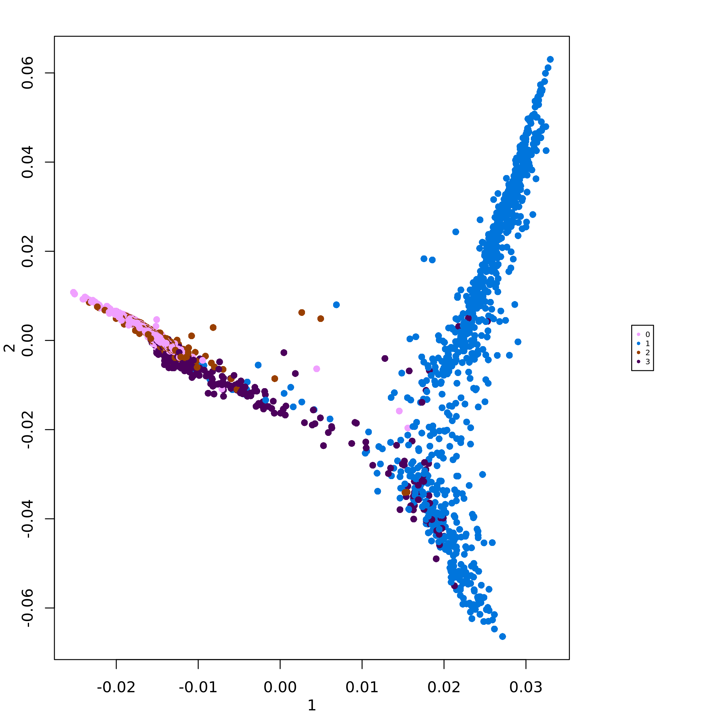

{width=300px}

# Installation

scMuffin requires R >= 4.0.0, due to some of its dependencies, like Seurat [@Hao2021]. R can be installed from CRAN at the URL https://cran.r-project.org/index.html.

To succesfully install scMuffin you need some packages from Bioconductor (https://bioconductor.org) and github (https://github.com/). These packages can be installed using the following commands:

```{r, include=TRUE, eval=FALSE}
if (!require("BiocManager", quietly = TRUE)){
  install.packages("BiocManager")
}
BiocManager::install(c("BiocStyle", "ComplexHeatmap", "DESeq2", "org.Hs.eg.db"))

if (!require("devtools", quietly = TRUE)){
  install.packages("devtools")
}
devtools::install_github("theislab/destiny")
```

The other dependencies, if missing, should be automatically installed using the following command:

```{r, include=TRUE, eval=FALSE}
devtools::install_github("emosca-cnr/scMuffin", build_vignettes = TRUE)
```

To load the package:

```{r, include=TRUE, eval=FALSE}
library(scMuffin)
```

```{r, include=F, message=FALSE, warning=FALSE, eval=T}
devtools::load_all()
```

# Input

scMuffin is intended to be used downstream general purpose tasks like quality control, normalization, cell clustering and dataset integration, for which there are dedicated tools, such as Seurat [@Hao2021]. scMuffin requires three inputs:

* genes-by-cells raw counts matrix;
* genes-by-cells normalized expression matrix;
* a partition of cells (cell clusters).

The rownames and colnames of the two matrices must be, respectively, gene identifiers and cell identifiers. Currently, we recommend to use official gene symbols. Some analysis, like CNV inference, works only with gene symbols.

Typically, the two genes-by-cells matrices have already been filtered to exclude low quality cells and genes that could negatively affect the analyses. However, the characterization of cells that can be achieved with scMuffin offers insights that can be used to (further) filter a dataset and/or to decide on which cells apply particular analyses (e.g. biomarker identification). In general, according to research questions and experimental design strong or mild filters should be applied before using scMuffin.

# Obtaining the data used in this vignette

Here's an example of how to obtain a publicly available single cell dataset from Gene Expression Omnibus (GEO). In particular, we will consider a sample from a study on High-Grade Glioma [@Yuan2018] (GSE103224):

1. download the filtered genes-by-cells mtrices from the URLs:

* sample PJ016: https://www.ncbi.nlm.nih.gov/geo/query/acc.cgi?acc=GSM2758471;

2. read the text files into R and use the Seurat package [@Hao2021] to perform a series of typical tasks (e.g. normalization, clustering); here's a concise example using sample PJ016:
```{r, include=TRUE, eval=FALSE}
library(Seurat)
gbc_counts <- read.table("GSM2758471_PJ016.filtered.matrix.txt", stringsAsFactors = F)
sym <- gbc_counts[, "V2"]
gbc_counts[, c("V1", "V2")] <- NULL
gbc_counts <- keep_strongest_representative(genes_by_cells = gbc_counts, sym)
	
seu_obj_1 <- CreateSeuratObject(counts = gbc_counts, project = "PJ016",
                                min.cells = 100, min.features = 1000)
seu_obj_1[["pMito"]] <- PercentageFeatureSet(seu_obj_1, pattern = "^MT-")
seu_obj_1 <-  subset(seu_obj_1,  subset = nFeature_RNA > 200 &
                       nFeature_RNA < 8000 & nCount_RNA < 30000 & pMito < 10)

seu_obj_1 <- NormalizeData(seu_obj_1)
seu_obj_1 <- FindVariableFeatures(seu_obj_1, selection.method = "vst",
                                  nfeatures = 2000)
seu_obj_1 <- ScaleData(seu_obj_1, features = rownames(seu_obj_1))
seu_obj_1 <- RunPCA(seu_obj_1, npcs = 10,
                    features = VariableFeatures(seu_obj_1))
seu_obj_1 <- FindNeighbors(seu_obj_1, dims = 1:10)
seu_obj_1 <- FindClusters(seu_obj_1)
seu_obj_1 <- RunUMAP(seu_obj_1, dims = 1:10)
seu_obj_1 <- CellCycleScoring(object = seu_obj_1,
                              g2m.features = cc.genes.updated.2019$g2m.genes,
                              s.features = cc.genes.updated.2019$s.genes)
```
The genes-by-cells count matrix available at NCBI GEO is provided with Ensembl identifiers and gene symbols, which are not unique. So, after having read the table, we used the function `keep_strongest_representative`, which defines a genes-by-cells matrix with symbols as row names. In case of multiple Ensembl ids mapped to the same symbol, the row with the highest average count is kept as representative of the gene.

In a real scenario, **the functions listed above should be run using appropriate parameter values** that take into account the specificities of the dataset under consideration and the objectives of the analysis to perform. Here we just wanted to provide a means to obtain a dataset to follow this vignette. Please read the Seurat documentation for further details about the functions listed above.

# The scMuffinList data structure
All data and results of scMuffin are stored in the scMuffinList, so that every function takes in input such structure and returns a modified version of it. The scMuffinList can be created as follows:
```{r, include=TRUE, eval=FALSE}
scML <- create_scMuffinList(counts = GetAssayData(seu_obj_1, assay = "RNA", slot = "counts"), 
                            normalized = GetAssayData(seu_obj_1, assay = "RNA", slot = "data"))
```
Many analyses require cell clusters. Any partition can be added as follows:
```{r, include=TRUE, eval=FALSE}
scML <- add_partitions(scML, 
                       clusters = seu_obj_1$seurat_clusters, 
                       partition_id = "global_expr")
```
where `seu_obj_1$seurat_clusters` is a named vector that contains cells clusters and whose names are cell labels. The element `partitions` of `scML` will contain cell clusters:

```{r, include=TRUE, eval=FALSE}
head(scML$partitions[, 1, drop = F])
```

```{r, echo=FALSE, eval=TRUE}
head(scML_demo$partitions[, 1, drop = F])
```

The function `add_features()` can be used to add custom results to the `scMuffinList`. In the following example we add the cell cycle phase:
```{r, include=TRUE, eval=FALSE}
scML <- add_features(scML, name = "CC_Phase", 
                     summary = cbind(CC_Phase = seu_obj_1$Phase))
```
```{r, include=TRUE, eval=FALSE}
head(scML$CC_Phase$summary)
```
```{r, echo=FALSE, eval=TRUE}
head(scML_demo$CC_Phase$summary)
```
The `summary` element of the scMuffinList is a data.frame intended to contain data about the feature, while element `full` can be used to store other supporting feature data (see other examples below).

# Gene set scoring

scMuffin provides functions to set up one or more collections of gene sets and perform cell-level estimation of gene set expression in relation to an empirical null model. This can be applied to any gene set and can therefore be used to estimate various cells’ phenotypes, like pathway activities or markers expression.

## Assembling input gene sets

The function `prepare_gsls` retrieves gene sets from CellMarker [@Zhang2019], PanglaoDB [@Franzen2019], CancerSEA [@Yuan2019] and MSigDB [@Subramanian2005], and accepts custom gene set as well. The full list of gene sets available whitin CellMarker, PanglaoDB and CancerSEA collections can be listed using:
```{r, include=TRUE, eval=FALSE}
data("gsls_EntrezID")
data("gsls_Symbol")
```

while in the case of MSigDB we can use its dedicated functions:

```{r, include=TRUE, eval=FALSE}
msigdbr::msigdbr_collections()
msigdbr::msigdbr_species()
```

The gene sets of interest can be selected acting on the corresponding arguments `CM_tissues`, `PNDB_tissues`, and `msigdb_hs_cat_subcat`. In the case of CellMarker and PanglaoDB we can specify a list of desired tissues. The full set can be listed by means of show_tissues. Here we show just the first part of the output:
```{r, echo=TRUE}
lapply(show_tissues(), head)
```

Here is an example:
```{r, include=TRUE, eval=FALSE}
gsc <- prepare_gsls(gs_sources = c("CancerSEA", "PNDB"), 
                    PNDB_tissues = c("Brain"), 
                    scMuffinList = scML, 
                    genes_min = 3)
```

Note that in the case of MSigDB we have to set up a `data.frame` to specify species, category and sub_category of the gene set collections.

## Calculate Gene set scores at cell and cluster level

In the following example, we estimate the scores for CancerSEA gene sets:

```{r, include=TRUE, eval=FALSE}
scML <- calculate_gs_scores(scMuffinList = scML, 
                            gs_list = gsc$CancerSEA)
```
The results of any analysis are stored as elements of the `scML`. The gene set scoring engine stores its results in `scML$gene_set_scoring`, where `summary` is a cells-by-features data.frame with cell scores, and `full` contains a series of additional details for every gene set:

```{r, include=TRUE, eval=FALSE}
head(scML$gene_set_scoring$summary)
head(scML$gene_set_scoring$full$Angiogenesis)
```
```{r, echo=FALSE, eval=TRUE}
head(scML_demo$gene_set_scoring$summary)
head(scML_demo$gene_set_scoring$full$Angiogenesis)
```

The values of cell-level scores can be used to color UMAP visualizations, which are automatically generated for every gene set using:

```{r, include=TRUE, eval=FALSE}
plot_umap_colored_features(scMuffinList = scML, 
                           Seu_obj = seu_obj_1, 
                           feature_name = "gene_set_scoring")
```

Here below, an example of UMAP visualization where cells are colored by CancerSEA "Hypoxia" gene set score.

{width=600px} 

The function `calculate_gs_scores_in_clusters` defines the median values of gene set scores in every cluster of a given partition id:
```{r, include=TRUE, eval=FALSE}
scML <- calculate_gs_scores_in_clusters(scMuffinList = scML, 
                                        partition_id = "global_expr")
```
```{r, include=TRUE, eval=FALSE}
scML$cluster_data$global_expr$gene_set_scoring$summary
```
```{r, echo=FALSE, eval=TRUE}
scML_demo$cluster_data$global_expr$gene_set_scoring$summary
```

These mean values are useful to obtain a concise visualization of gene set expression throughout the dataset, using the function `plot_heatmap_features_by_clusters`:
```{r, include=TRUE, eval=FALSE}
plot_heatmap_features_by_clusters(scMuffinList = scML, 
                                  feature_source = "gss")
```
{width=600px} 

# CNV inference

## CNV calculation
CNV inference is performed by the function `CNV_analysis`.

```{r, include=TRUE, eval=FALSE}
scML <- CNV_analysis(scML)
```
The results are stored in `scML$CNV`, where: 

* `summary` contains the CNV score;
* `scML$CNV$full$CNV` contains the regions-by-cells matrix of CNV profiles; 
* `scML$CNV$full$regions2genes` is important to map the original data into the CNV regions;
* `scML$CNV$full$detected_cnv_regions` is a data.frame that list the CNV regions detected in each chromosome and cell cluster:


```{r, include=TRUE, eval=FALSE}
head(scML$CNV$summary)
head(scML$CNV$full$CNV)
head(scML$CNV$full$regions2genes)
head(scML$CNV$full$detected_cnv_regions$chr1)
```
```{r, echo=FALSE, eval=TRUE}
head(scML_demo$CNV$summary)
head(scML_demo$CNV$full$CNV)
head(scML_demo$CNV$full$regions2genes)
head(scML_demo$CNV$full$detected_cnv_regions$chr1)
```
Importantly, CNV inference adds the "CNV" partition:
```{r, include=TRUE, eval=FALSE}
head(scML$partitions)
```
```{r, echo=FALSE, eval=TRUE}
head(scML_demo$partitions)
```

The calculation can be demanding. For example, it requires approximately 10 minutes on 2 cores (dual Intel(R) Xeon(R), 2.60GHz). 

## CNV visualization

scMuffin provides two visualizations for CNVs: an heatmap and the cluster average profile plot. The heatmap is based on ComnplexHeatmap package and enables the visualization of the genomic location of a series of given genes (specified in the argument `genes`), or, alternatively, the location of detected CNVs (argument `mark.detected.cnv = T`)


```{r, include=TRUE, eval=FALSE}
col_fun <- circlize::colorRamp2(seq(-0.2, 0.2, length.out = 11), 
                                rev(pals::brewer.rdylbu(11)))
heatmap_CNV(scMuffinList = scML, 
            genes = c("YBX1", "HNRNPM"), 
            genes.labels = T, 
            col = col_fun)

heatmap_CNV(scMuffinList = scML, mark.detected.cnv = T, col=col_fun)

```

{width=600px}
{width=600px}

The function `plot_profile_CNV` plots the median CNV profile of a cluster:

```{r, include=TRUE, eval=FALSE}
plot_profile_CNV(scMuffinList = scML, cluster = 0, cex.points = 0.5) 
```
{width=600px}

# Transcriptional complexity

The transcriptional complexity (TC) can be quantified by means of the function `transcr_compl`. The corresponding summary element contains a `data.frame` with the number of cell transcripts, the number of genes detected in every cell, the TC-ratio (C), the TC-LMR (linear model residual) and the TC-H (entropy):

```{r, include=TRUE, eval=FALSE}
scML <- transcr_compl(scML)
```
```{r, include=TRUE, eval=FALSE}
head(scML$transcr_compl$summary)
```
```{r, echo=FALSE, eval=TRUE}
head(scML_demo$transcr_compl$summary)
```

# Cell proliferation rate

Cell proliferation is quantified considering the maximum between the two scores of G1/S and G2/M gene sets:
```{r, include=TRUE, eval=FALSE}
scML <- proliferation_analysis(scMuffinList = scML)
```
The proliferation score is stored in the `summary` element of `scML$proliferation`:
```{r, include=TRUE, eval=FALSE}
head(scML$proliferation$summary)
```
```{r, echo=FALSE, eval=TRUE}
head(scML_demo$proliferation$summary)
```

# Cell state trajectories
Diffusion maps identify differentiation trajectories. scMuffin relies on the diffusion pseudo time calculation available in the R package "destiny" [@Angerer2016]. Here we calculate the diffusion map over the first 50 PC (to speed up computation), using a random cell to obtain diffusion pseudotimes:

```{r, include=TRUE, eval=FALSE}
scML <- diff_map(scML, 
                 root_cell = "random",
                 n_pcs = 50)
```
A data.frame with the most important features of the analysis (the first two eigenvectors, pseudotime, branch information and whether a cell is a tip of the branch or not) are stored `scML$diffusion_map_pseudo_t$summary`:

```{r, include=TRUE, eval=FALSE}
scML$diffusion_map_pseudo_t$summary
```
```{r, echo=FALSE, eval=TRUE}
scML_demo$diffusion_map_pseudo_t$summary
```
The full DPT object from destiny is stored in the element `scML$diffusion_map_pseudo_t$full`. This allows the user to take advantage of destiny [functions](https://github.com/theislab/destiny/), such as `plot()`, e.g.
```{r, include=TRUE, eval=FALSE}
destiny::plot(scML$diffusion_map_pseudo_t$full, col_by = 'branch')
```
The function `plot_diff_map()` visualizes a diffusion map where cells are colored by any other set of cell-level values. In the following example we plot the diffusion map colored by CNV-based cell clusters:
```{r, include=TRUE, eval=FALSE}
plot_diff_map(scMuffinList = scML, 
              col_data = setNames(scML$partitions$CNV, rownames(scML$partitions)))
```

{width=600px}

# Cluster enrichment assessment

Cell clusters can be assessed for enrichment in quantitative and categorical values. The appropriate statistical test is automatically chosen according to feature type. In this example, we assess cluster enrichment for the feature `gene_set_scoring` (quantitative one) for the cluster defined by the partition `global_expr`:
```{r, include=TRUE, eval=FALSE}
scML <- assess_cluster_enrichment(scML, 
                                  feature_name = "gene_set_scoring", 
                                  partition_id = "global_expr")
```
In case of quantitative features the result is a list named CSEA, placed under the elements `cluster_data$global_expr` (partition id). The list contains the gene set table and the leading edge results. Here's the result related to the gene set `Angiogenesis`:
```{r, include=TRUE, eval=FALSE}
scML$cluster_data$global_expr$CSEA$Angiogenesis
```
```{r, echo=FALSE, eval=TRUE}
scML_demo$cluster_data$global_expr$CSEA$Angiogenesis
```
In this this example, we assess cluster enrichment in relation to the categorical feature `CC_Phase`, namely the cell cycle phase calculated by means of Seurat function [`CellCycleScoring()`](https://satijalab.org/seurat/reference/cellcyclescoring) and added to `scML` by means of `add_features()` (see above):
```{r, include=TRUE, eval=FALSE}
scML <- assess_cluster_enrichment(scML, 
                                  feature_name = "CC_Phase", 
                                  partition_id = "global_expr")
```
As for categorical features the result is a list named ORA, placed under the elements `cluster_data$global_expr` (partition id). The list contains ORA results for every categorical value. Here's the enrichment of clusters in terms of cells with value "G1":
```{r, include=TRUE, eval=FALSE}
scML$cluster_data$global_expr$ORA$CC_Phase$G1
```
```{r, echo=FALSE, eval=TRUE}
scML_demo$cluster_data$global_expr$ORA$CC_Phase$G1
```

The enrichment analysis results appearing in these tables can be easily extracted and organized in a clusters-by-values table by means of `extract_cluster_enrichment_table`. For instance, here we extract CSEA NES and FDRq values, and ORA er (enrichment ratio) values:
```{r, include=TRUE, eval=FALSE}
csea_fdr_table <- extract_cluster_enrichment_table(scML,  
                                                   partition_id = "global_expr", 
                                                   type = "CSEA", 
                                                   quantity = "FDRq")
csea_nes_table <- extract_cluster_enrichment_table(scML,  
                                                   partition_id = "global_expr", 
                                                   type = "CSEA",
                                                   quantity = "nes")
ora_p_table <- extract_cluster_enrichment_table(scML, 
                                                partition_id = "global_expr", 
                                                type = "ORA", 
                                                quantity = "p")
csea_fdr_table
```
```{r, echo=FALSE, eval=TRUE}
csea_fdr_table <- extract_cluster_enrichment_table(scML_demo,  
                                                   partition_id = "global_expr", 
                                                   type = "CSEA", 
                                                   quantity = "FDRq")
csea_fdr_table
```
These tables can be plotted with the function `plot_heatmap_features_by_clusters`. In the following example we plot NES values with asterisks according to their significance:

```{r, include=TRUE, eval=FALSE}
plot_heatmap_features_by_clusters(feature_source = csea_nes_table, 
                                  significance_matrix = csea_fdr_table, 
                                  sig_threshold = 0.05)
```
{width=600px}

Similarly, it's possible to extract the most significant "tags" of any clusters; for example, here we extract the top 3 tags by FDRq (CSEA) and p_adj (ORA):
```{r, include=TRUE, eval=FALSE}
scML <- extract_cluster_enrichment_tags(scML, 
                                        partition_id = "global_expr", 
                                        n_max_per_cluster = 3, 
                                        CSEA_selection_criterion = "FDRq", 
                                        only_pos_nes = TRUE, 
                                        CSEA_selection_threshold = 0.05, 
                                        ORA_selection_criterion = "p_adj", 
                                        ORA_selection_threshold = 0.25)
```
The results are placed under the `cluster_tags` element:
```{r, include=TRUE, eval=FALSE}
head(scML$cluster_data$global_expr$cluster_tags$CSEA)
```
```{r, echo=FALSE, eval=TRUE}
head(scML_demo$cluster_data$global_expr$cluster_tags$CSEA)
```

The results of cluster enrichment can be visualized by barplots and boxplots for, respectively, categorical values and quantitative values.
```{r, include=TRUE, eval=FALSE}
barplot_cluster(scML, 
                partition_id = "global_expr", 
                feature_name = "CC_Phase", 
                feature_id = "CC_Phase")
boxplot_cluster(scML, 
                feature_name = "gene_set_scoring", 
                partition_id = "global_expr")
```
{width=600px}
 {width=600px}
 
# Comparison between clusters

## Intra-dataset

The function `overlap_matrix` calculates the overlap coefficient between all-pairs of clusters of two or more partitions of the same cells (same dataset):

```{r, include=TRUE, eval=FALSE}
scML <- overlap_matrix(scML)
```
The results are stored under the element `cluster_comparison```:
```{r, include=TRUE, eval=FALSE}
head(scML$cluster_comparison$overlap_matrix)
```
```{r, echo=FALSE, eval=TRUE}
head(scML_demo$cluster_comparison$overlap_matrix)
```

## Inter-dataset

Inter-dataset comparison is performed through the function `inter_dataset_comparison`, which require a list of Seurat objects and a gene set list. The activity of this gene set list will be assessed over the clusters of all datasets. In needed, the function `prepare_cluster_markers_list` provides the possibility to prepare a gene set list of cluster markers, starting 

```{r, include=TRUE, eval=FALSE}
dataset_cmp_res <- inter_dataset_comparison(seu_obj_list = seu_obj_list, 
                                            gsl = cluster_markers_list, 
                                            genes_max = 500, genes_min = 5)
plot_heatmap_dataset_comparison(dataset_cmp_res, 
                                outfile = "heatmap_ds_cmp.png")
plot_heatmap_dataset_comparison(dataset_cmp_res, 
                                outfile = "heatmap_ds_cmp_p.png", 
                                type = "significance")
```
{width=600px}
{width=600px}

The function can be used to analyze any gene set. In the following example we assess the expression of CancerSEA gene sets across datasets:

```{r, include=TRUE, eval=FALSE}
gsl <- prepare_gsls(gs_sources = "CancerSEA", 
                    genes = unlist(lapply(seu_obj_list, rownames)))
dataset_cmp_res_cancersea <- inter_dataset_comparison(seu_obj_list = seu_obj_list, 
                                                      gsl = gsl$CancerSEA, 
                                                      genes_max = 500, 
                                                      genes_min = 5)
plot_heatmap_dataset_comparison(dataset_cmp_res_cancersea, 
                                outfile = "heatmap_ds_cmp_cancer.png")
```
{width=600px}

# References

<!-- ## Comparison of partitions and definition of meta-clusters

Lastly, scMuffin provides some functions to compare 

```{r, include=TRUE, eval=FALSE}
cl_list <- partitions_to_list(partitions = clust_obj)
ov_mat <- overlap_matrix(cl_list)
meta_cl <- meta_cluster(ov_mat, n_step = 10, max_clust = 15)
meta_cl_cell <- get_meta_clusters(cl_list, meta_cl)
plot_meta_clusters(ov_mat, meta_clusters = meta_cl)
```
-->